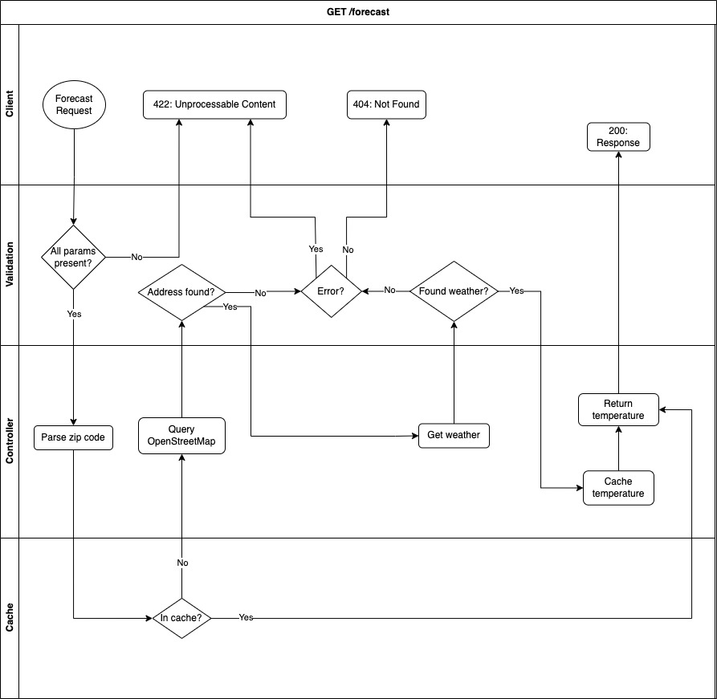

# Weather App

This application allows a user to enter an address and get the current temperature of the provided address. After the user has queried a specific zip code, then subsequent requests for the same zip code will be cached for 30 minutes.

## Getting Started
1. Download this repo
2. Open terminal
3. Change directory to this repo
4. Run `bundle`
5. Run rails s
6. Visit localhost:3000 in your browser

### Tested Addresses

#### Not Found
123 street
Nowhere, PA 12345

#### Found
525 Winchester Boulevard
San Jose, California 95128

## Design
The following is a breakdown of the expected flows while using this application.

### External Services

This application relies on the [OpenStreetMap gem](https://github.com/WebGents/open_street_map) and the [National Weather Service API](https://weather-gov.github.io/api/general-faqs).